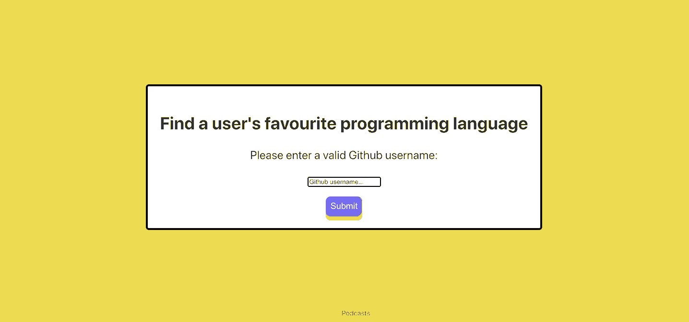

# Github - Favourite Programming Language (Made with React)

<p align="center">
  
</p>

# The Challenge

**Github (API) test**

We would like you to build a web or command line application,which should allow users to enter an arbitrary Github username,and be presented with a best guess of the Github user's favourite programming language. This can be computed by using the Github API to fetch all of the user's **public** Github repositories, each of which includes the name of the dominant language for the repository. Documentation for the Github API can be found at https://developer.github.com/v3/

You may use any programming language, framework, or library.

# User Stories

```
As a user
So I can find someone's Github profile
I'd like to able enter and search for a particular Github username 
```
```
As a user 
so I can find out what someones favourite programming language is
I'd like a button which displays the selected users favourite programming language(s).
```

# Process

- I Decided to use React for ease of creating a simple web application.
- Used Axios to fetch data back from the API and used the language frequency to determine a given users favourite programming language. I feel with more time there could be a more efficient way (perhaps using file size or number of file commits?)
- Refactored code throughout where appropriate 
# Installation

1. Clone this repository

2. type git clone "https://github.com/Thatguy560/Favourite-Programming-Language.git" in the terminal

3. cd into 'Favourite-Programming-Language' (Change directory's)

4. Install node.js and run npm install in command line to install dependencies

# How To Run (Locally)

1. Open up a terminal in your text editor and type "npm start".

2. This should then automatically open the app on your browser, however if it doesn't just open up any browser of your choosing and type in the url "http://localhost:3000/".

3. Once loaded, type in an arbitrary Github user in the input box and click submit when you're ready.

# Alternatively Visit the deployed app

Click [here](https://favourite-programming-language.herokuapp.com/) for the deployed app on Heroku.
# Technologies Used

#### React, Javascript, HTML/CSS

